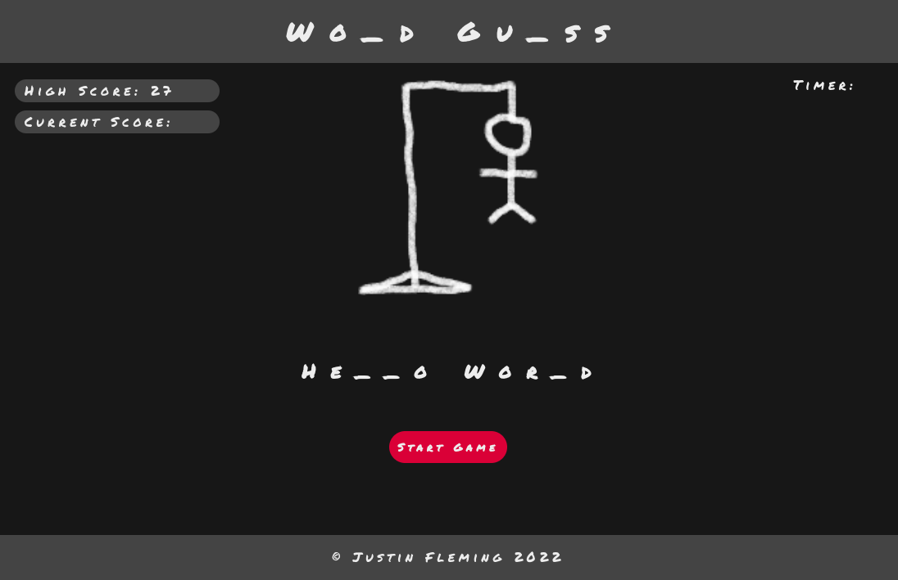

# Word-Guess

## Description

Start the game by clicking on the start button. Then try and guess the word(s) by filling in a number of blanks that match the number of letters in that word. If all the letters are filled before the timer runs out, the user wins. If the user wins and their score is higher than the highscore, their score will replace the highscore.

The score is calculated by 1 point per letter guessed. If all letters are guessed before the time runs out, the remain time will be add to the score as a bonus. If there are more than one of the letters guessed then the user get a point for each time that letter is used in the word.

## Usage

1. Start the game by clicking on start button. 
2. Use the keyboard buttons to make guesses to the word's letters before the timer runs out. 
3. If all the letters are filled before the timer runs out, the user wins.
4. If the user makes 6 wrong guess then they loose.
5. If the timer runs out befor the word(s) are guessed, the user looses.

## Credits

[JQuery](https://jquery.com/)
[Google Fonts](https://fonts.google.com/)

I take credit for the design and development of this site.

## License

